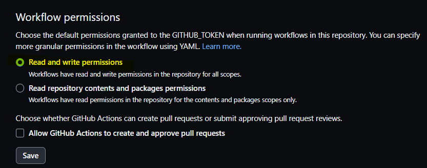
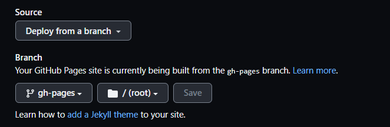

# nextjs-github-pages-sample
GitHub PagesにNext.js をデプロイする

## 1.Node.jsインストールする
- [Node.js - ダウンロード](https://nodejs.org/ja/download)

## 2.Next.jsを初期設定
```bash
$ mkdir [リポジトリ名]
$ cd [リポジトリ名]
$ npm init -y
$ npm install --save react react-dom next
$ mkdir pages
```

## 3.静的サイトを生成
```bash
# ビルド
$ npm run build
# 静的サイトを生成
$ npm run export
# ローカル起動
$ npm run start
```
## 4.ローカル確認
ブラウザで`http://localhost:3000`で動作確認

## 5.GitHub Pagesにデプロイ
`.github/workflows/gh-pages.yml`でGitHub Actionsを実行


- デプロイでエラーがでたら
```
Action failed with "The process '/usr/bin/git' failed with exit code 128"
```
Settings → Actions → General ＞ `read and write permissions`に変更



## 6.GitHub Pagesのリポジトリに設定変更
リポジトリ ＞ Settings ＞ Pages ＞ Brnchを`gh-pages`に変更



## 7.GitHub Pagesに接続
- https://takanori-azegami-jp.github.io/nextjs-github-pages-sample/


## 参考
- [GitHub PagesにNext.js をデプロイする](https://qiita.com/manten120/items/87e9e822800403904dc8)
- [【3.0対応】Flutter webをGithub PagesにデプロイするGithub Actions](https://zenn.dev/nekomimi_daimao/articles/26fd2e3b763191)
